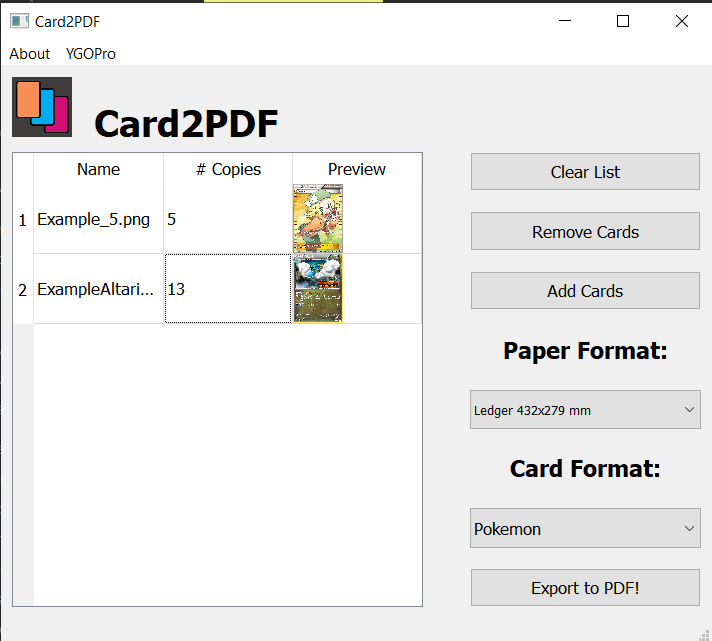
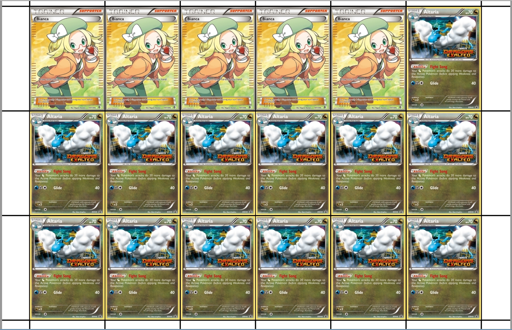

# Card2PDF
Card2PDF is a simple GUI program that gathers TCG Card images and arranges them with the desired measures in a PDF document to be later printed.
## WHY
Me and my friends ofen physically print TCG cards to play (because tcg is expensive af).
We needed to arange all the cards manually on some pdf editor with the correct measures in order to actually print them.

## Preview
### GUI Preview

### Output Preview


## Installation and Usage

If you just want to use it, no questions asked: check out the .exe generated by [pyinstaller](https://www.pyinstaller.org/) at the [Latest Release](https://github.com/alcros33/Card2PDF/releases/latest)

If you want to mess around with the code: install pyqt5 and pyinstaller (if you want to generate a single executable) and execute main.py

``` bash
pip install pyqt5 pyinstaller --user
python Card2PDF/main.py
```

To bundle your build into a single executable use pyinstaller (be sure to have python scripts folder in your path):

``` bash
make_and_release.bat # or make_and_release.sh on bash
```


## Want another type of card?
Edit the Formats.json file and add the dimensions (in mm) of your desired card!
